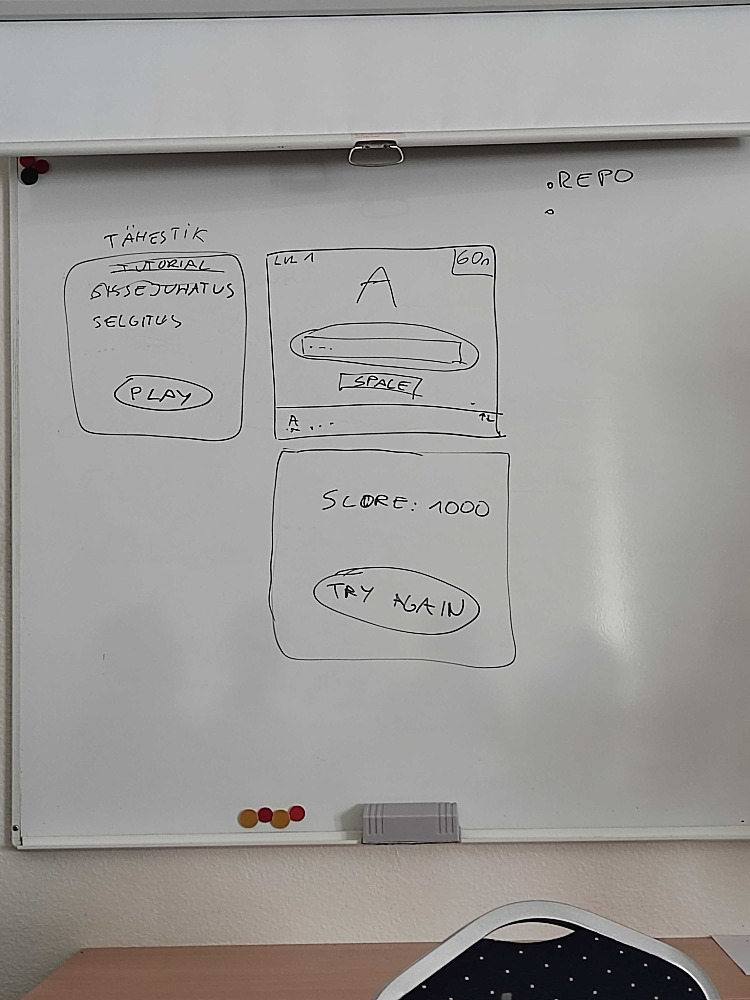

# Steampunk-morse

## Morse code learning game for everyone

## Members

* Jana
* Oliver
* Remi
* Rain
* Raimond
* Raiko
# Project goal
When in time of crisis and all communication fails, we are left with good old morse code, that almost never fails.
So we made an easy learning game for all ages, that gives you the basic knowledge of morse code.
## Morse code.
It´s a method used in telecommunication to encode text characters as standardized sequences of two different signal durations, called dots and dashes, or dits and dahs. Morse code is named after Samuel Morse, one of the inventors of the telegraph. Morse code was developed in 1830s and that first message was sent on 24 May, 1844. At the time of its invention, it was the fastest long distance form of communication.
## Commiunication was in Slack
## For project we used: Vue+vite, JavaScript, HTML, CSS
## Day 1
Got together and got to know each other.
Had a brainstorm and everyone got to tell their ideas.
Decided on an idea and started to put together the plan.
Started desinging in Figma and started to write the code.
## Day 2
Made plan for day 2 and assigned tasks.
Continue with Figma and code writing.
Researching design for our game.
## Day 3
Started to write README.
Made few design changes and corrections.
# Team members comments
## Raimond
Most important is to work with the team (communicate). Also I learned more about Figma by how it works and saw how some coding is done, it takes much time and thinking. It's interesting to work with different people to see how the progress of the project goes.
## Jana
It´s hard to tell what knowledge I could use from this project for another one, because we couldn´t finish this one due to a lack of time. But I got to improve my team work and from technical side I learned and improved Figma, GitHub and a little bit of JavaScript.
## Rain
28.09 - 30.09 project day I learned about teamwork and how can you share labor distribution. I personally learned about morse codea and what can you to in Frigma, all you need is a little bit imagination. Saw JavaScript programming.
I wish I could have been more useful.
## Raiko
Mostly I learned about Morse code and how to use it. I got the change to learn and write README. I saw how the coding works on Visual Studio( HTML, JavaScript, CSS...) but it was really hard and needs lot of practise. Big part of the project we practised how to work together as a team.
## Oliver 
Got a chance to remind the basics of JavaScript. Also how to set up project on Git using Vite. 